# Puppies-Game 系统建模报告

**项目名称**: Puppies-Game（狗国建设者）  
**报告日期**: 2026年3月  
**版本**: 1.0  
**建模工具**: Mermaid (GitHub原生支持)

---

## 1. 建模概述

本报告使用UML（统一建模语言）对Puppies-Game系统进行建模，包含：

- **用例图** - 描述用户与系统的交互
- **类图** - 描述系统的数据结构和关系
- **序列图** - 描述关键场景的流程
- **状态图** - 描述游戏和对象的状态变迁
- **ER图** - 描述数据存储结构
- **活动图** - 描述游戏循环流程

---

## 2. 用例图

### 2.1 高层用例图

用例图展示系统提供的主要功能和参与者交互。

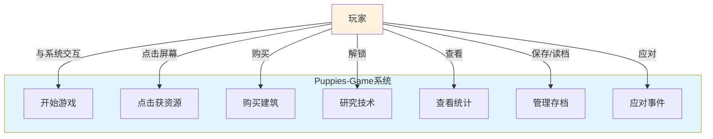

---

## 3. 类图

### 3.1 核心领域模型类图

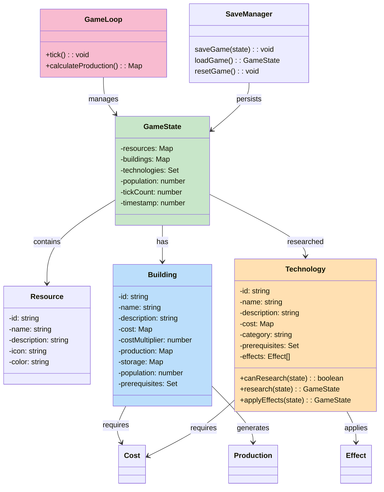

### 3.2 UI组件类图

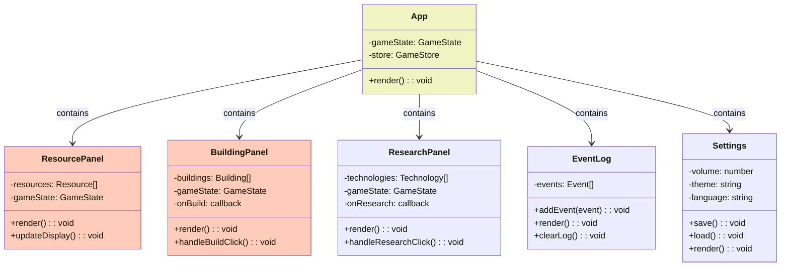

---

## 4. 序列图

### 4.1 游戏启动序列

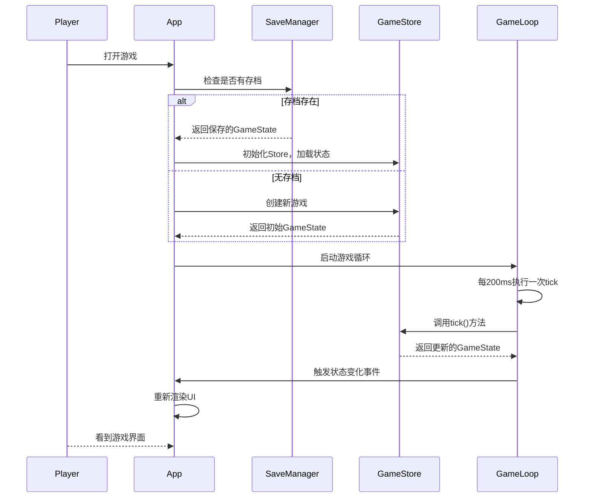

### 4.2 购买建筑序列

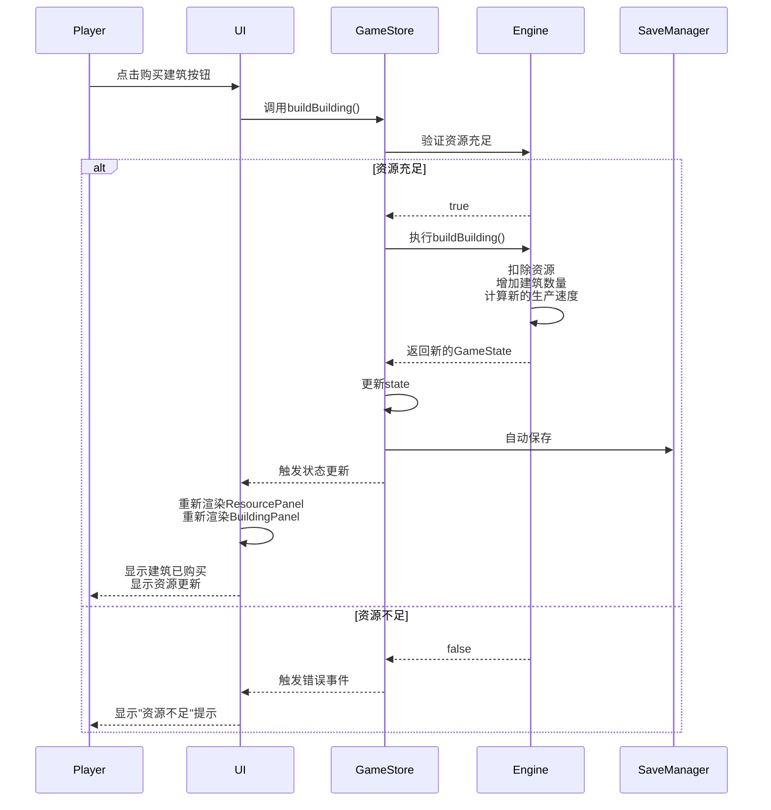

### 4.3 研究技术序列

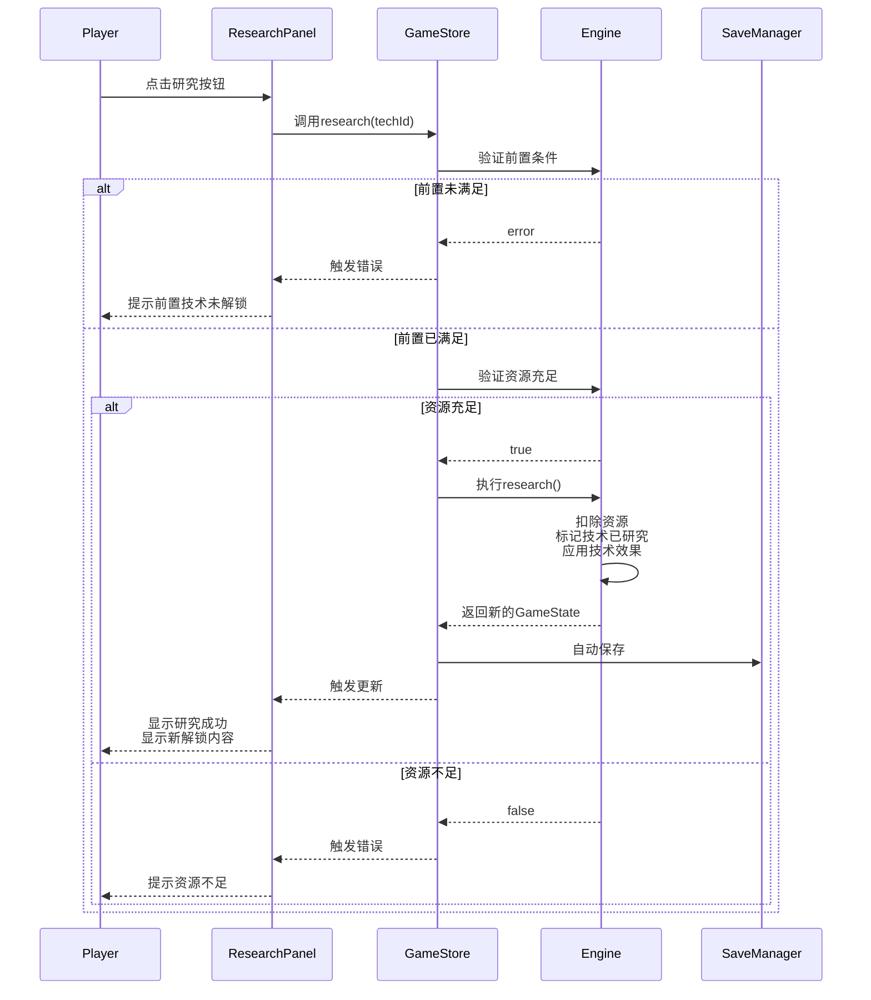

### 4.4 自动保存序列

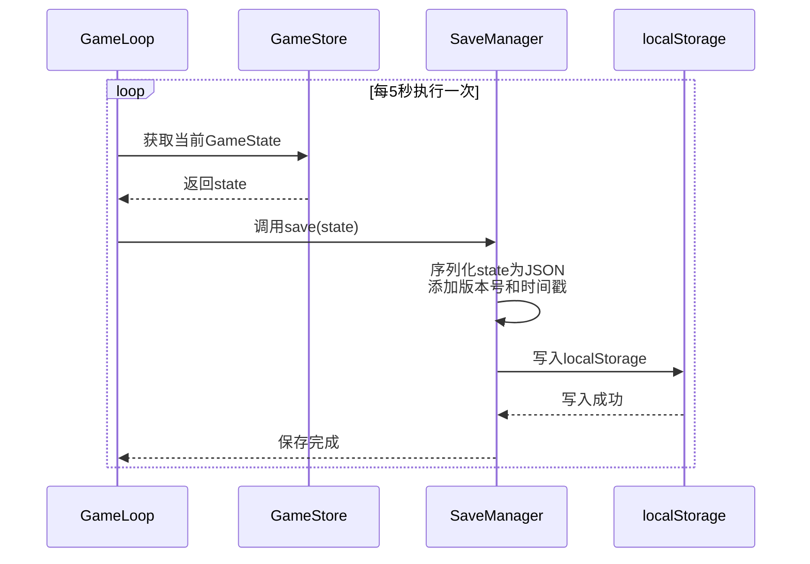

---

## 5. 状态图

### 5.1 游戏主状态图

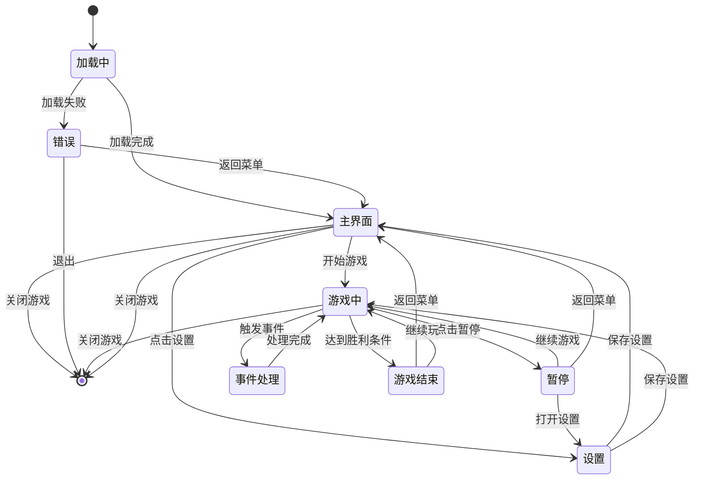

### 5.2 建筑可用性状态图

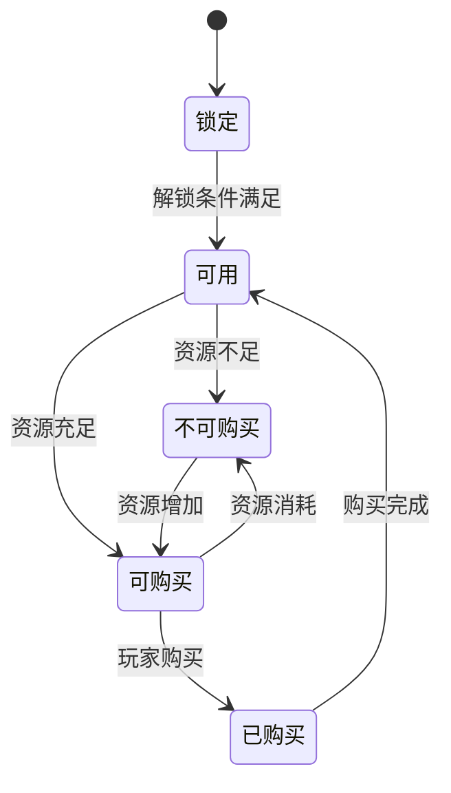

### 5.3 技术研究状态图

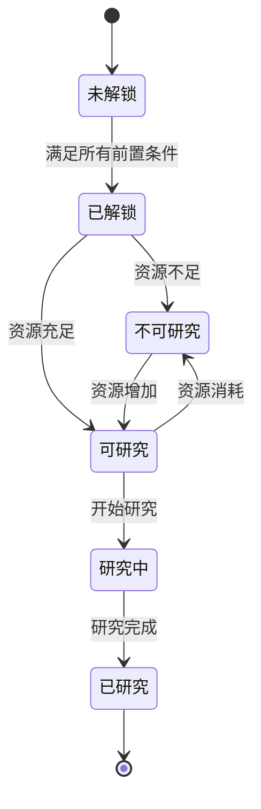

---

## 6. 活动图

### 6.1 游戏循环活动图

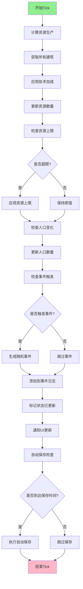

### 6.2 购买建筑活动图

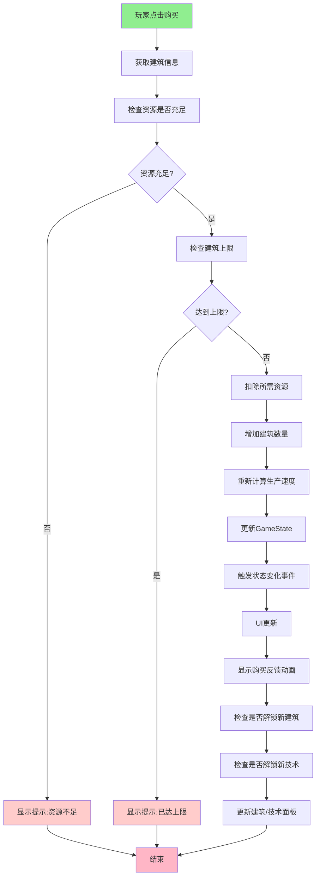

---

## 7. 数据流图 (DFD)

### 7.1 第一层数据流图 - 系统上下文

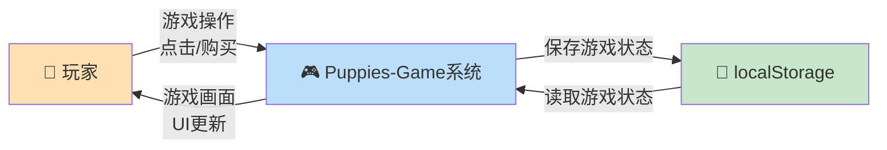

### 7.2 第二层数据流图 - 核心流程

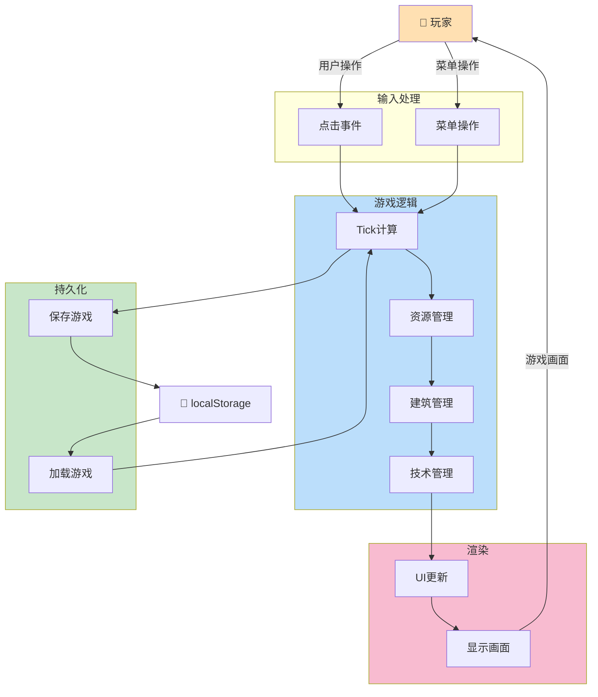

---

## 8. 组件图

### 8.1 系统组件视图

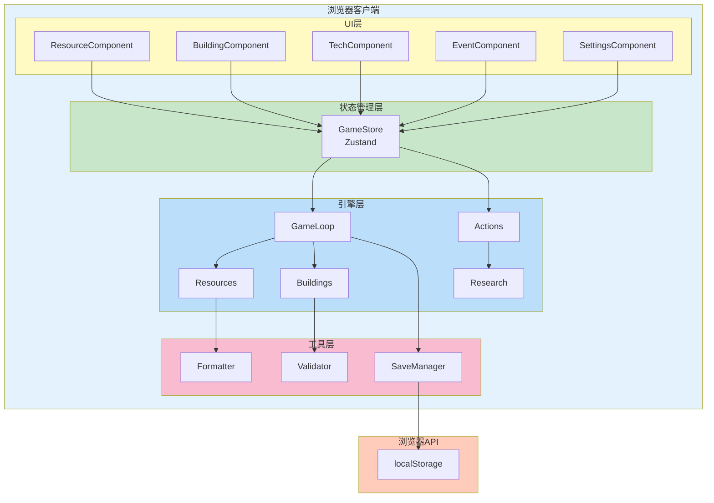
