# Puppies-Game 系统建模报告

**项目名称**: Puppies-Game（狗国建设者）
**更新日期**: 2026-07-01

## 1. 建模范围

本报告使用 UML 和数据流模型描述 Puppies-Game 的主要结构与行为，覆盖：

- 用例图：玩家与系统的交互边界。
- 类图：核心领域对象、状态对象与 UI/store/engine 分层关系。
- 序列图：启动、tick、购买建筑、研究科技、离线结算等关键流程。
- 状态图：游戏状态、建筑可用状态、狗狗个体状态。
- 活动图：主循环与玩家决策流程。
- 数据流图：本地存档与游戏引擎之间的数据流。

## 2. 用例图

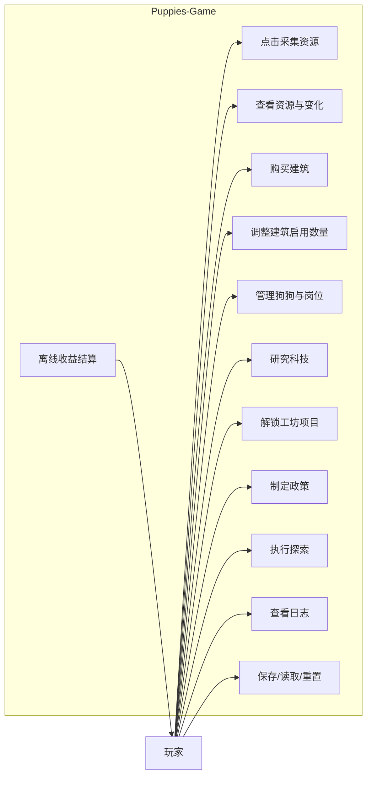
```mermaid
flowchart LR
  Player["玩家"]

  subgraph Game["Puppies-Game"]
    UC1["点击采集资源"]
    UC2["查看资源与变化"]
    UC3["购买建筑"]
    UC4["调整建筑启用数量"]
    UC5["管理狗狗与岗位"]
    UC6["研究科技"]
    UC7["解锁工坊项目"]
    UC8["制定政策"]
    UC9["执行探索"]
    UC10["查看日志"]
    UC11["保存/读取/重置"]
    UC12["离线收益结算"]
  end

  Player --> UC1
  Player --> UC2
  Player --> UC3
  Player --> UC4
  Player --> UC5
  Player --> UC6
  Player --> UC7
  Player --> UC8
  Player --> UC9
  Player --> UC10
  Player --> UC11
  UC12 --> Player
```

## 3. 类图

### 3.1 领域模型

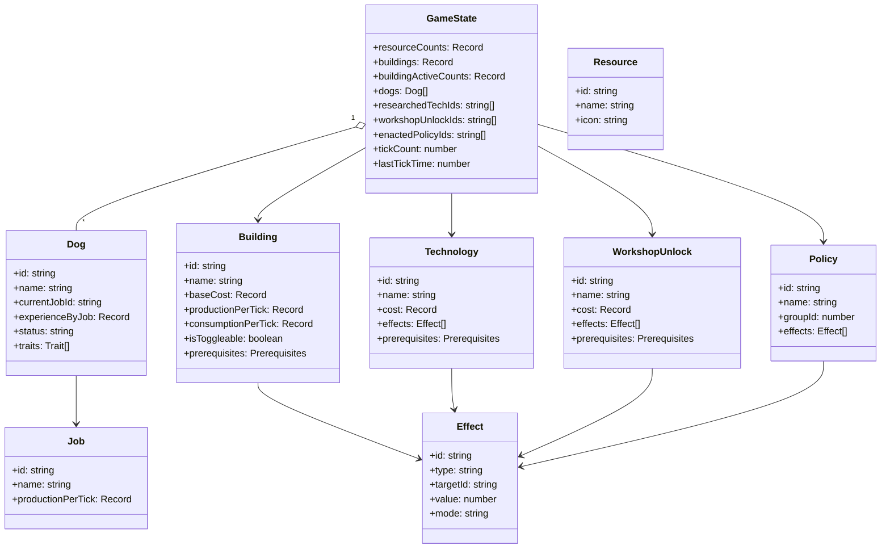
```mermaid
classDiagram
  class GameState {
    +resourceCounts: Record
    +buildings: Record
    +buildingActiveCounts: Record
    +dogs: Dog[]
    +researchedTechIds: string[]
    +workshopUnlockIds: string[]
    +enactedPolicyIds: string[]
    +tickCount: number
    +lastTickTime: number
  }

  class Resource {
    +id: string
    +name: string
    +icon: string
  }

  class Building {
    +id: string
    +name: string
    +baseCost: Record
    +productionPerTick: Record
    +consumptionPerTick: Record
    +isToggleable: boolean
    +prerequisites: Prerequisites
  }

  class Dog {
    +id: string
    +name: string
    +currentJobId: string
    +experienceByJob: Record
    +status: string
    +traits: Trait[]
  }

  class Job {
    +id: string
    +name: string
    +productionPerTick: Record
  }

  class Technology {
    +id: string
    +name: string
    +cost: Record
    +effects: Effect[]
    +prerequisites: Prerequisites
  }

  class WorkshopUnlock {
    +id: string
    +name: string
    +cost: Record
    +effects: Effect[]
    +prerequisites: Prerequisites
  }

  class Policy {
    +id: string
    +name: string
    +groupId: number
    +effects: Effect[]
  }

  class Effect {
    +id: string
    +type: string
    +targetId: string
    +value: number
    +mode: string
  }

  GameState "1" o-- "*" Dog
  GameState --> Building
  GameState --> Technology
  GameState --> WorkshopUnlock
  GameState --> Policy
  Building --> Effect
  Technology --> Effect
  WorkshopUnlock --> Effect
  Policy --> Effect
  Dog --> Job
```

### 3.2 分层结构

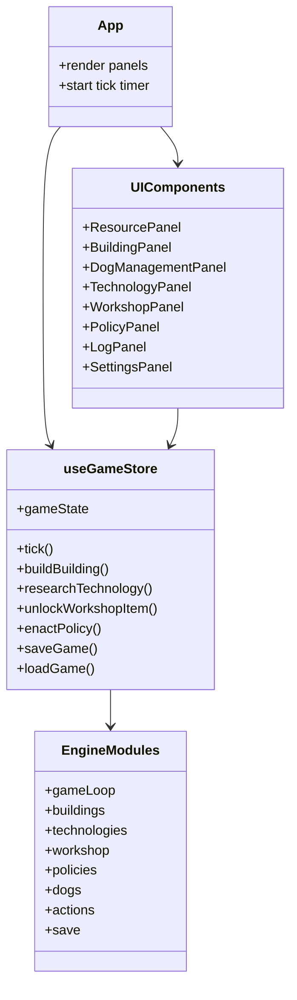
```mermaid
classDiagram
  class App {
    +render panels
    +start tick timer
  }

  class useGameStore {
    +gameState
    +tick()
    +buildBuilding()
    +researchTechnology()
    +unlockWorkshopItem()
    +enactPolicy()
    +saveGame()
    +loadGame()
  }

  class EngineModules {
    +gameLoop
    +buildings
    +technologies
    +workshop
    +policies
    +dogs
    +actions
    +save
  }

  class UIComponents {
    +ResourcePanel
    +BuildingPanel
    +DogManagementPanel
    +TechnologyPanel
    +WorkshopPanel
    +PolicyPanel
    +LogPanel
    +SettingsPanel
  }

  App --> UIComponents
  App --> useGameStore
  UIComponents --> useGameStore
  useGameStore --> EngineModules
```

## 4. 序列图

### 4.1 游戏启动与离线结算

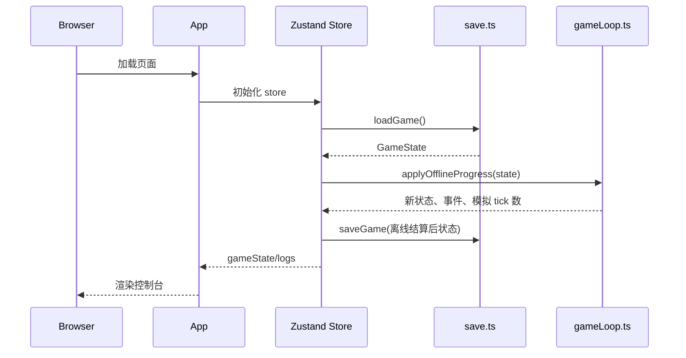
```mermaid
sequenceDiagram
  participant Browser
  participant App
  participant Store as Zustand Store
  participant Save as save.ts
  participant GameLoopEngine as gameLoop.ts

  Browser->>App: 加载页面
  App->>Store: 初始化 store
  Store->>Save: loadGame()
  Save-->>Store: GameState
  Store->>GameLoopEngine: applyOfflineProgress(state)
  GameLoopEngine-->>Store: 新状态、事件、模拟 tick 数
  Store->>Save: saveGame(离线结算后状态)
  Store-->>App: gameState/logs
  App-->>Browser: 渲染控制台
```

### 4.2 自动 tick

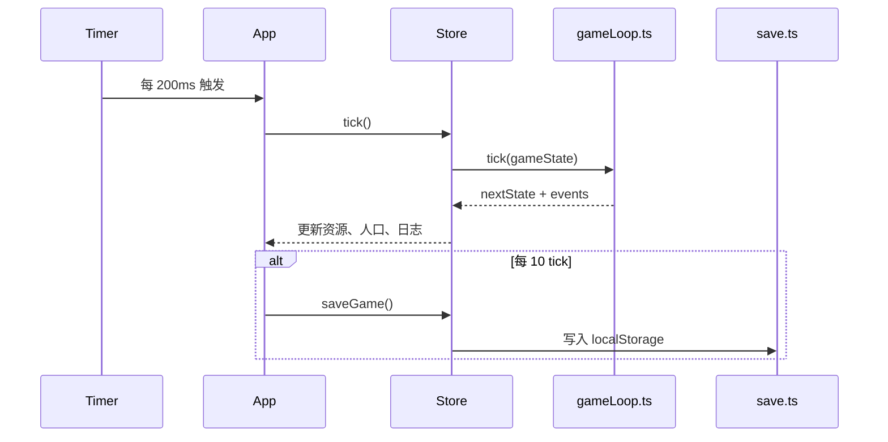
```mermaid
sequenceDiagram
  participant Timer
  participant App
  participant Store
  participant Engine as gameLoop.ts
  participant Save as save.ts

  Timer->>App: 每 200ms 触发
  App->>Store: tick()
  Store->>Engine: tick(gameState)
  Engine-->>Store: nextState + events
  Store-->>App: 更新资源、人口、日志
  alt 每 10 tick
    App->>Store: saveGame()
    Store->>Save: 写入 localStorage
  end
```

### 4.3 购买建筑

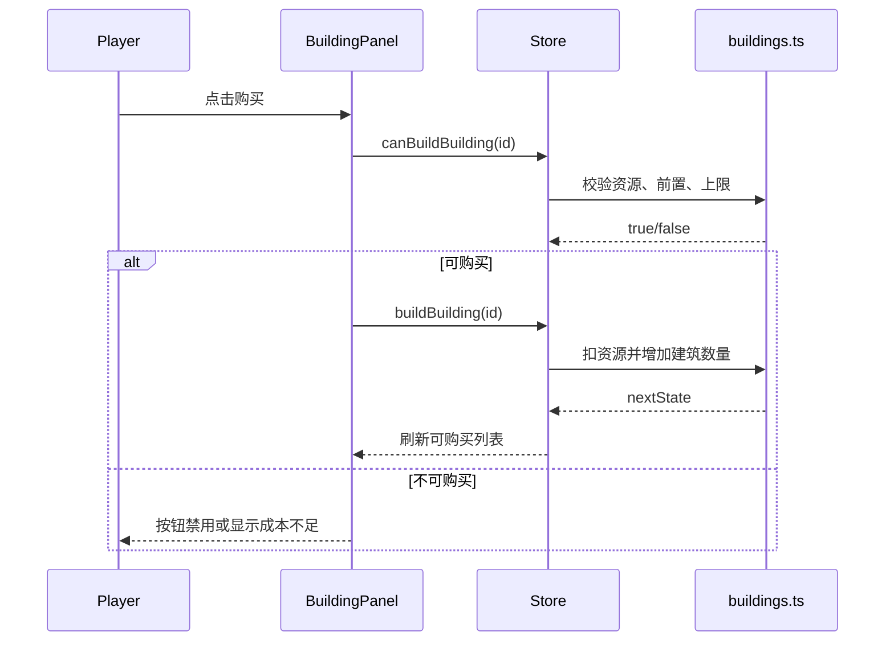
```mermaid
sequenceDiagram
  participant Player
  participant Panel as BuildingPanel
  participant Store
  participant Building as buildings.ts

  Player->>Panel: 点击购买
  Panel->>Store: canBuildBuilding(id)
  Store->>Building: 校验资源、前置、上限
  Building-->>Store: true/false
  alt 可购买
    Panel->>Store: buildBuilding(id)
    Store->>Building: 扣资源并增加建筑数量
    Building-->>Store: nextState
    Store-->>Panel: 刷新可购买列表
  else 不可购买
    Panel-->>Player: 按钮禁用或显示成本不足
  end
```

### 4.4 研究科技

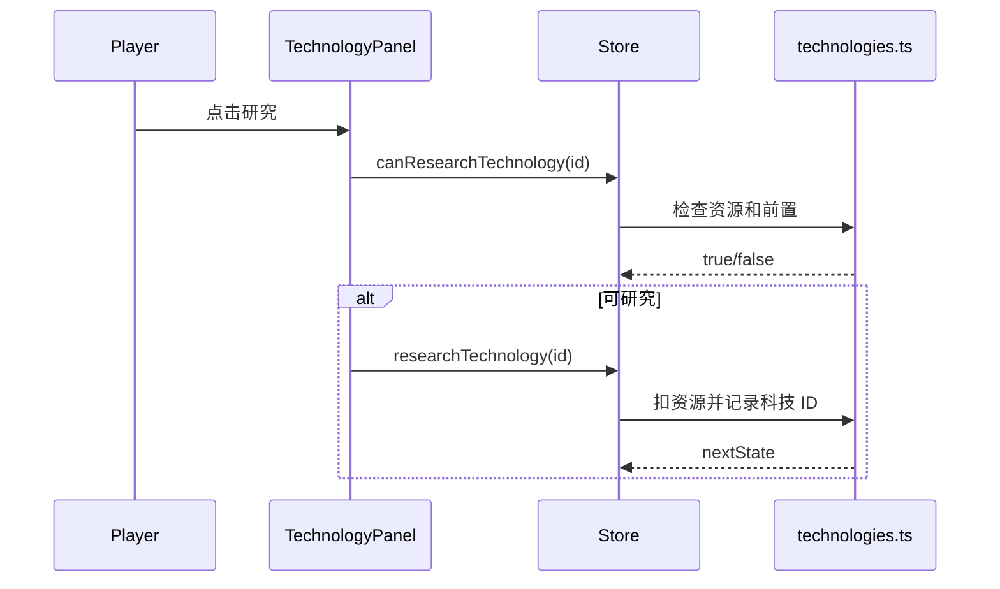
```mermaid
sequenceDiagram
  participant Player
  participant Panel as TechnologyPanel
  participant Store
  participant Tech as technologies.ts

  Player->>Panel: 点击研究
  Panel->>Store: canResearchTechnology(id)
  Store->>Tech: 检查资源和前置
  Tech-->>Store: true/false
  alt 可研究
    Panel->>Store: researchTechnology(id)
    Store->>Tech: 扣资源并记录科技 ID
    Tech-->>Store: nextState
  end
```

## 5. 状态图

### 5.1 游戏运行状态

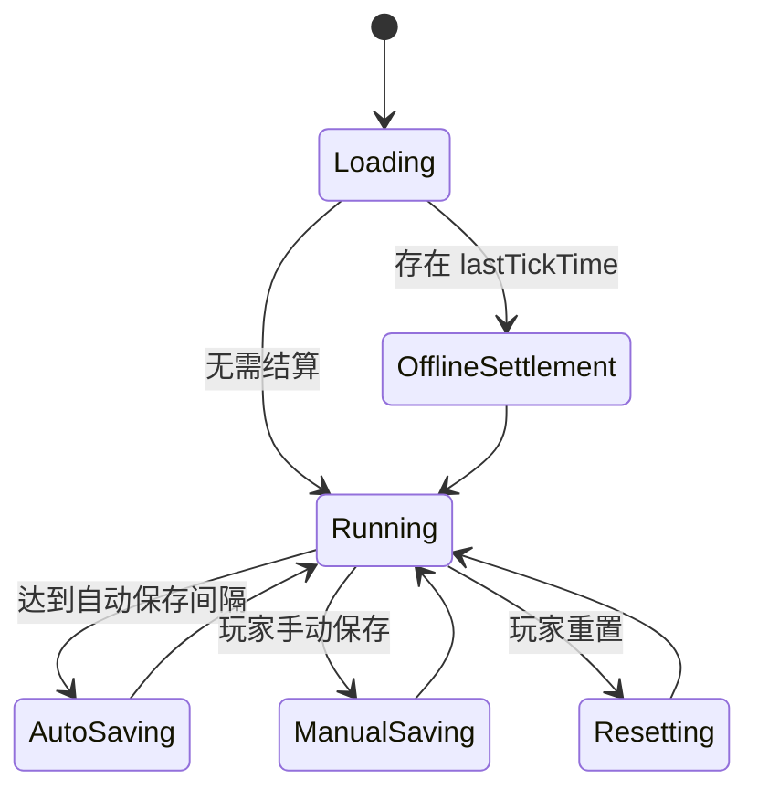
```mermaid
stateDiagram-v2
  [*] --> Loading
  Loading --> OfflineSettlement: 存在 lastTickTime
  Loading --> Running: 无需结算
  OfflineSettlement --> Running
  Running --> AutoSaving: 达到自动保存间隔
  AutoSaving --> Running
  Running --> ManualSaving: 玩家手动保存
  ManualSaving --> Running
  Running --> Resetting: 玩家重置
  Resetting --> Running
```

### 5.2 建筑可用状态

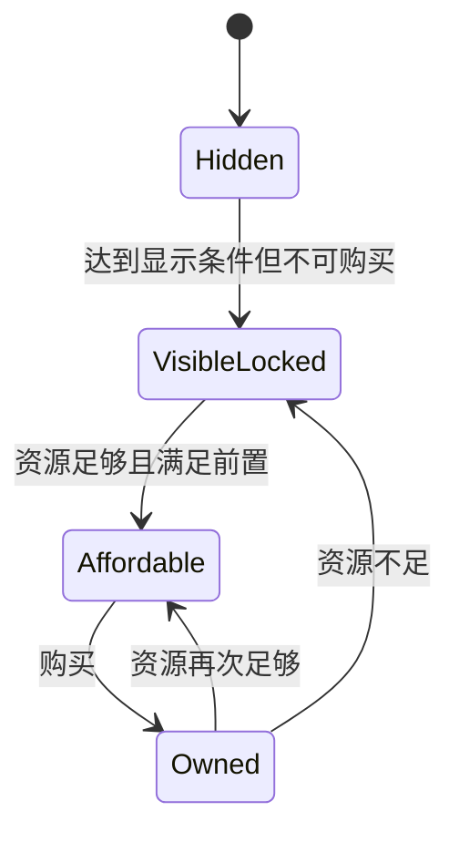
```mermaid
stateDiagram-v2
  [*] --> Hidden
  Hidden --> VisibleLocked: 达到显示条件但不可购买
  VisibleLocked --> Affordable: 资源足够且满足前置
  Affordable --> Owned: 购买
  Owned --> VisibleLocked: 资源不足
  Owned --> Affordable: 资源再次足够
```

### 5.3 狗狗状态

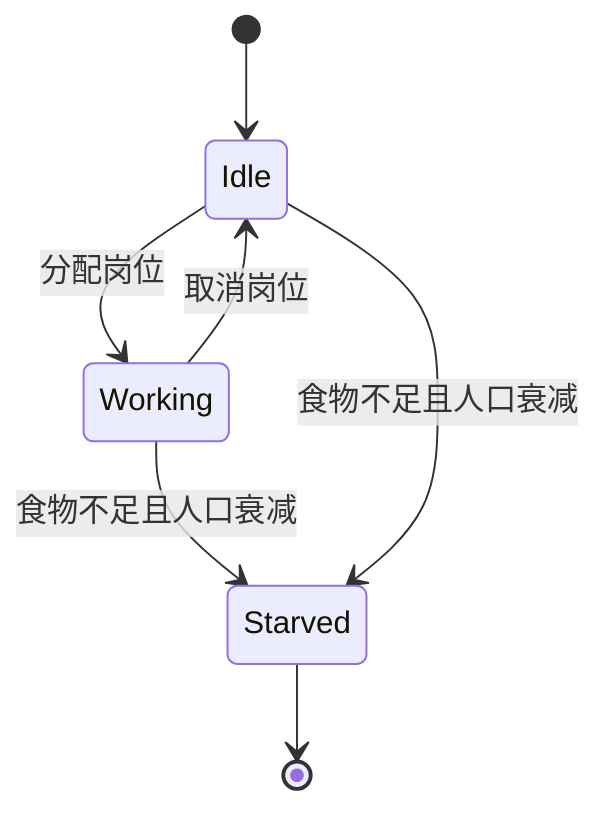
```mermaid
stateDiagram-v2
  [*] --> Idle
  Idle --> Working: 分配岗位
  Working --> Idle: 取消岗位
  Working --> Starved: 食物不足且人口衰减
  Idle --> Starved: 食物不足且人口衰减
  Starved --> [*]
```

## 6. 活动图

### 6.1 主循环活动

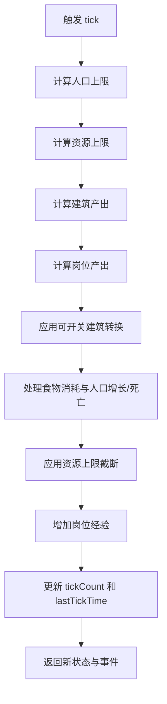
```mermaid
flowchart TD
  A["触发 tick"] --> B["计算人口上限"]
  B --> C["计算资源上限"]
  C --> D["计算建筑产出"]
  D --> E["计算岗位产出"]
  E --> F["应用可开关建筑转换"]
  F --> G["处理食物消耗与人口增长/死亡"]
  G --> H["应用资源上限截断"]
  H --> I["增加岗位经验"]
  I --> J["更新 tickCount 和 lastTickTime"]
  J --> K["返回新状态与事件"]
```

### 6.2 玩家推进活动

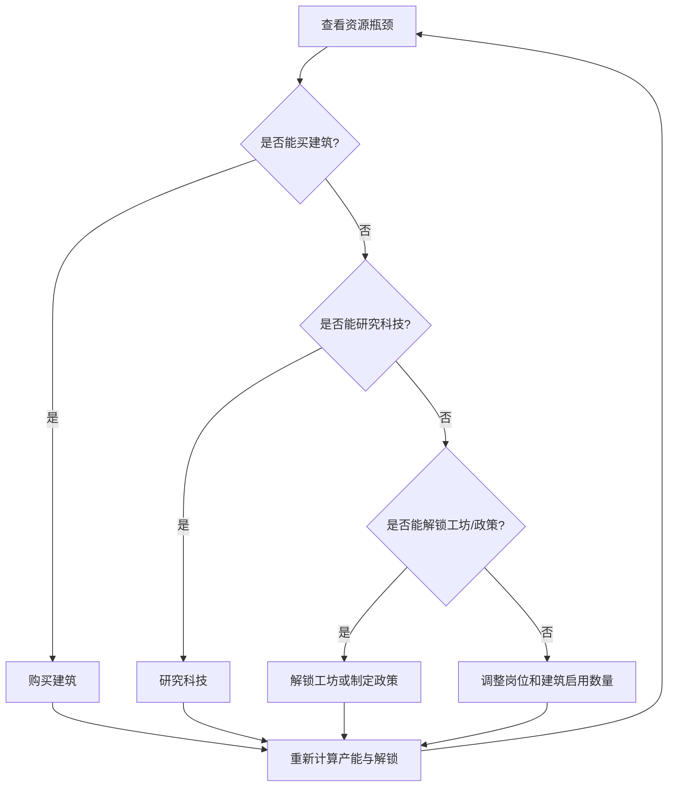
```mermaid
flowchart TD
  A["查看资源瓶颈"] --> B{"是否能买建筑?"}
  B -->|是| C["购买建筑"]
  B -->|否| D{"是否能研究科技?"}
  D -->|是| E["研究科技"]
  D -->|否| F{"是否能解锁工坊/政策?"}
  F -->|是| G["解锁工坊或制定政策"]
  F -->|否| H["调整岗位和建筑启用数量"]
  C --> I["重新计算产能与解锁"]
  E --> I
  G --> I
  H --> I
  I --> A
```

## 7. 数据流图

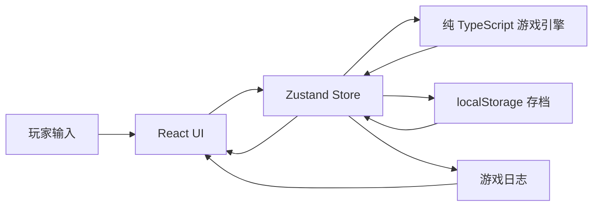
```mermaid
flowchart LR
  Player["玩家输入"] --> UI["React UI"]
  UI --> Store["Zustand Store"]
  Store --> Engine["纯 TypeScript 游戏引擎"]
  Engine --> Store
  Store --> UI
  Store --> LocalStorage["localStorage 存档"]
  LocalStorage --> Store
  Store --> Logs["游戏日志"]
  Logs --> UI
```

## 8. 模型与实现对应关系

| 模型元素 | 实现位置 |
| --- | --- |
| GameState、Resource、Building、Technology、Policy | `src/engine/types.ts` |
| tick、生产、人口、离线结算 | `src/engine/gameLoop.ts` |
| 建筑购买与启用数量 | `src/engine/buildings.ts` |
| 科技解锁与效果聚合 | `src/engine/technologies.ts` |
| 工坊解锁 | `src/engine/workshop.ts` |
| 政策互斥组 | `src/engine/policies.ts` |
| 存档 | `src/engine/save.ts` |
| UI 状态桥接 | `src/store/gameStore.ts` |
| 面板 UI | `src/components/*.tsx` |
