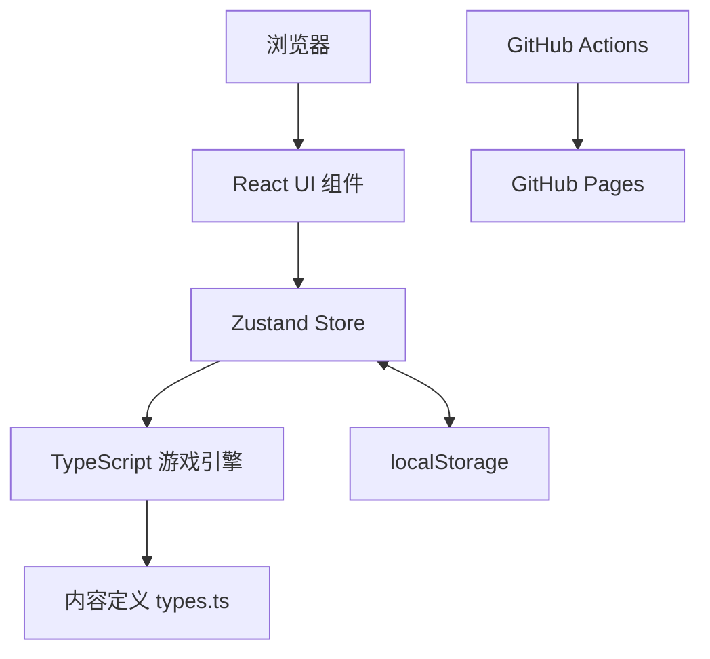

# Puppies-Game 架构设计文档

**项目名称**: Puppies-Game（狗国建设者）
**更新日期**: 2026-07-01

## 1. 架构目标

Puppies-Game 的架构目标是支持一个可长期演化的浏览器增量游戏：

- 游戏规则可测试：核心计算不依赖 DOM 和 React。
- 内容可扩展：新增资源、建筑、科技、工坊、政策时优先修改数据定义。
- UI 可替换：界面组件只通过 store 读取状态和触发动作。
- 部署简单：项目以静态资源形式发布，无服务端依赖。
- 存档可靠：状态持久化在浏览器 localStorage，并支持离线收益结算。

## 2. 总体架构

系统采用单页应用架构。React 负责界面渲染，Zustand 负责状态聚合，`src/engine/` 负责领域规则，Vite 输出静态构建产物。

## 3. 分层设计

| 层次 | 目录/文件 | 主要职责 |
| --- | --- | --- |
| 展示层 | `src/App.tsx`、`src/components/` | 页面布局、面板展示、用户交互 |
| 状态层 | `src/store/gameStore.ts` | 暴露动作、维护游戏状态、处理日志和存档 |
| 领域层 | `src/engine/*.ts` | 游戏规则、资源计算、购买、科技、政策、离线结算 |
| 内容层 | `src/engine/types.ts` | 资源、岗位、建筑、科技、工坊、政策、效果定义 |
| 持久化层 | `src/engine/save.ts` | localStorage 保存、读取、重置 |
| 工程层 | `package.json`、`.github/workflows/cicd.yml` | 脚本、测试、构建、部署 |

## 4. 关键模块

### 4.1 App 与 UI 面板

`App.tsx` 建立整体布局和 tick 定时器。主要面板包括：

- `ResourcePanel`: 资源存量与变化展示。
- `BuildingPanel`: 建筑列表、成本、购买、启用数量。
- `DogManagementPanel`: 狗狗、岗位、领袖、改名。
- `TechnologyPanel`: 科技可见性、成本、研究。
- `WorkshopPanel`: 工坊项目解锁。
- `PolicyPanel`: 政策组和互斥选择。
- `LogPanel`: 探索、饥荒、离线收益日志。
- `SettingsPanel`: 保存、读取、重置。

### 4.2 Store 适配层

`gameStore.ts` 是 UI 与 engine 的边界：

- 初始化时读取存档并调用 `applyOfflineProgress`。
- 每 200ms 调用一次 `engineTick`。
- 为 UI 提供 `buildBuilding`、`researchTechnology`、`unlockWorkshopItem`、`enactPolicy` 等动作。
- 把 engine 返回的事件转换为游戏日志。
- 负责自动保存与手动保存/读取/重置。

### 4.3 游戏引擎

`src/engine/` 中的核心模块：

| 模块 | 职责 |
| --- | --- |
| `gameLoop.ts` | 生产、人口、资源上限、离线收益、tick 推进 |
| `buildings.ts` | 建筑成本、购买条件、购买行为、启用数量 |
| `technologies.ts` | 科技可见性、研究条件、效果聚合 |
| `workshop.ts` | 工坊项目可见性、解锁条件、解锁行为 |
| `policies.ts` | 政策组、互斥规则、政策可见性 |
| `actions.ts` | 点击资源、岗位分配、探索、政策等动作 |
| `dogs.ts` | 狗狗创建、命名、经验、岗位状态 |
| `calendar.ts` | 游戏日历和季节 |
| `save.ts` | 本地存档 |
| `simulation.ts` | 长周期玩法模拟与平衡验证 |

## 5. 数据设计

### 5.1 GameState

`GameState` 是系统的核心状态对象，包含：

- `resourceCounts`: 各资源数量。
- `buildings`: 建筑拥有数量。
- `buildingActiveCounts`: 可开关建筑启用数量。
- `dogs`: 狗狗列表。
- `researchedTechIds`: 已研究科技。
- `workshopUnlockIds`: 已解锁工坊项目。
- `enactedPolicyIds`: 已采用政策。
- `populationCap`: 人口上限。
- `populationGrowthProgress`: 人口增长进度。
- `tickCount`: 游戏 tick 数。
- `lastTickTime`: 最近 tick 时间，用于离线结算。

### 5.2 Effect 模型

科技、建筑、工坊、政策和特质都可以通过 `Effect` 表达加成。常见效果包括：

- `job_production`: 提升岗位产出。
- `building_production`: 提升建筑产出。
- `resource_limit`: 提升资源上限。

通过统一效果模型，系统可以把多个来源的加成聚合后应用到生产计算中。

## 6. 关键设计决策

### 6.1 纯前端静态部署

项目不引入服务端，原因是课程项目更关注软件工程实践和游戏规则实现。纯前端架构降低部署复杂度，可直接发布到 GitHub Pages。

代价是暂不支持云存档、账号系统和多人交互。后续若增加服务端，可保持 engine 层不变，在持久化层增加远程同步。

### 6.2 引擎与 UI 分离

游戏规则集中在 `src/engine/`，UI 只调用 store 动作。这让资源计算、购买逻辑、科技解锁、离线收益等规则可以用 Vitest 直接测试，减少 UI 自动化测试成本。

### 6.3 数据驱动内容

资源、岗位、建筑、科技、工坊和政策集中在 `types.ts` 中定义。新增内容时通常只需要添加数据项和必要测试，不需要大幅改动 UI。

### 6.4 离线收益上限

离线收益最多结算 8 小时。这样既符合放置游戏“回来有收益”的预期，又避免长时间离线导致加载时模拟过多 tick。

### 6.5 后期内容时间门槛

部分高阶内容使用 `requiredTickCount` 作为时间门槛，配合资源与建筑前置，避免玩家在短时间内透支全部内容。

## 7. 部署架构

## 8. 架构风险与应对

| 风险 | 影响 | 应对 |
| --- | --- | --- |
| 存档结构变化 | 旧存档可能无法读取 | 在 `save.ts` 中维护加载默认值和迁移策略 |
| 内容膨胀 | 面板列表过长、性能下降 | 使用滚动区域和可见性过滤，必要时分组 |
| tick 计算复杂度上升 | UI 卡顿 | 保持 engine 纯函数、限制离线模拟 tick、必要时批量模拟 |
| 纯前端存档丢失 | 玩家清缓存会丢进度 | 后续可增加导入/导出或云存档 |
| 后期平衡失控 | 游戏目标断层 | 使用 `simulation.ts` 长周期模拟辅助调整 |

## 9. 可演化方向

- 增加成就/声望/轻量转生系统。
- 增加远征地图和更丰富的事件系统。
- 将内容定义拆分为独立数据文件。
- 引入端到端测试覆盖关键用户流程。
