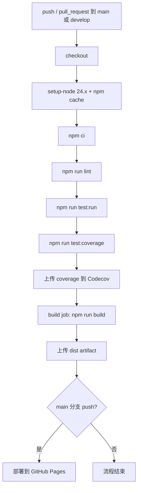

# Puppies-Game 软件工程化实践文档

**项目名称**: Puppies-Game（狗国建设者）
**更新日期**: 2026-07-01

## 1. 工程化目标

本项目的工程化目标是让一个课程级 Web 游戏项目具备可协作、可测试、可构建、可部署、可演化的开发流程。项目当前采用前后端分离中的纯前端静态应用形态，重点通过类型系统、自动化测试、CI/CD、模块化架构和版本控制降低维护成本。

## 2. 技术栈

| 类别 | 工具 | 用途 |
| --- | --- | --- |
| 语言 | TypeScript 5.9 | 类型安全、领域模型约束 |
| UI 框架 | React 19 | 构建交互式游戏界面 |
| 构建工具 | Vite 8 | 开发服务器与生产构建 |
| 状态管理 | Zustand 5 | 管理全局游戏状态 |
| 样式 | Tailwind CSS 4 | 原子化样式 |
| 组件 | shadcn/radix-ui | 基础 UI 控件 |
| 图标 | lucide-react | 面板与按钮图标 |
| 通知 | sonner | toast 提示 |
| 测试 | Vitest 4、Testing Library、jsdom | 单元测试与组件环境 |
| 质量 | ESLint 9、Prettier 3 | 静态检查与格式化 |
| 部署 | GitHub Pages | 静态站点发布 |

## 3. 项目结构

```text
puppies-game/
  docs/                   # 课程提交文档与补充设计资料
  src/
    components/           # React 面板组件与通用 UI 组件
    engine/               # 纯 TypeScript 游戏规则与测试
    hooks/                # React hooks
    lib/                  # 通用工具
    store/                # Zustand store，连接 UI 与引擎
    App.tsx               # 应用入口布局与 tick 定时器
    main.tsx              # React 挂载入口
  .github/workflows/      # CI/CD 工作流
  package.json            # npm scripts 与依赖
  vite.config.ts          # Vite 配置
```

## 4. 自动化脚本

| 命令 | 作用 | 使用场景 |
| --- | --- | --- |
| `npm run dev` | 启动 Vite 开发服务器 | 本地开发 |
| `npm run build` | TypeScript 构建 + Vite 生产构建 | 发布前验证 |
| `npm run preview` | 预览生产构建产物 | 部署前检查 |
| `npm run lint` | ESLint 静态检查 | 提交前与 CI |
| `npm run test` | Vitest watch 模式 | 开发中持续测试 |
| `npm run test:run` | 单次运行测试 | CI 与提交前 |
| `npm run test:coverage` | 生成覆盖率报告 | 质量评估 |
| `npm run format` | 格式化 `src` 下 TS/TSX 文件 | 代码整理 |
| `npm run deploy` | 发布 `dist` 到 gh-pages | 手动部署备用 |

## 5. CI/CD 流程

GitHub Actions 工作流定义在 `.github/workflows/cicd.yml`。



CI/CD 的关键工程化收益：

- 所有合并请求自动执行 lint、测试、覆盖率和构建。
- 测试通过后才执行构建，降低错误产物传播风险。
- main 分支 push 后自动部署 GitHub Pages。
- 使用 `npm ci` 和 lockfile 保持依赖安装一致。

## 6. 模块化与解耦

项目把游戏规则放在 `src/engine/`，把界面放在 `src/components/`，把状态桥接放在 `src/store/gameStore.ts`。

| 层次 | 责任 |
| --- | --- |
| UI 层 | 展示资源、建筑、狗狗、科技、工坊、政策、日志与设置 |
| Store 层 | 暴露用户操作方法，维护全局状态，处理日志与存档调用 |
| Engine 层 | 纯函数式计算游戏规则，包括生产、购买、科技、政策、存档 |
| 配置数据层 | 在 `types.ts` 中集中定义资源、建筑、科技、政策等内容 |

这种划分使大部分业务逻辑可以在不启动浏览器的情况下用 Vitest 单元测试验证。

## 7. 协作流程

### 7.1 分支建议

- `main`: 可部署主分支。
- `develop`: 集成开发分支。
- `feature/*`: 功能开发分支。
- `fix/*`: 缺陷修复分支。
- `docs/*`: 文档更新分支。

### 7.2 提交规范

建议使用 Conventional Commits：

```text
feat: 增加新的建筑或玩法
fix: 修复资源计算或 UI 问题
test: 添加或更新测试
docs: 更新课程文档
refactor: 重构但不改变行为
chore: 依赖、配置或脚手架调整
```

### 7.3 Pull Request 检查清单

- 说明变更动机和影响范围。
- 标明已运行的命令，例如 `npm run lint`、`npm run test:run`、`npm run build`。
- 涉及游戏规则时补充或更新 `src/engine/*.test.ts`。
- 涉及 UI 时检查桌面和窄屏布局。
- 合并前确认 CI 通过。

## 8. 质量自动化

### 8.1 TypeScript

`npm run build` 会先执行 `tsc -b`，保证类型错误不能进入生产构建。

### 8.2 ESLint

`npm run lint` 检查 TypeScript、React Hooks、React Refresh 等规则，减少常见错误。

### 8.3 Prettier

`npm run format` 用于统一源码格式，降低代码审查中的格式噪音。

### 8.4 Vitest

测试主要覆盖 `src/engine/` 中的纯逻辑模块，包括 actions、buildings、dogs、gameLoop、initialState、policies、save、simulation、technologies、workshop。

## 9. 文档工程化

依据课程要求，文档按提交件编号组织：

| 编号 | 文档 |
| --- | --- |
| 01 | 需求分析报告 |
| 02 | 系统建模报告 |
| 03 | 架构设计文档 |
| 04 | 软件工程化实践文档 |
| 05 | 软件测试与质量保证报告 |
| 06 | 软件配置与运维文档 |
| 07 | 团队报告 |

